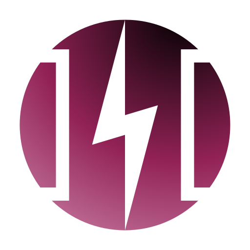

<p align="center"><a href="https://konduit.channel" target="_blank"></a></p>

# Konduit

> A Cardano to Bitcoin Lightning Network pipe.

This project is incubating. Expect sharp edges.

## Vision

An ada holder can have the same experience as a BLN user when paying merchants.

See the [design](./docs/design/) for more details.

## Structure

- [`./connector`](./connector/) - API query layer for Cardano.
- [`./docs`](./docs/) - Meeting notes, adrs, design docs.
- [`./kernel`](./kernel/) - Konuit kernel aka on-chain code. An Aiken repo.
- [`./rust`](./rust/) - Tools for konduit. A rust workspace.

## API Reference(s)

- [Rust & WASM API Reference](https://cardano-lightning.github.io/konduit/rust)

## Contributing

TBC.

## Developing

### Using nix

For the base devel:

```
$ nix develop
```

For something extra, e.g. cardano-cli, use:

```
$ nix develop .#extras
```
