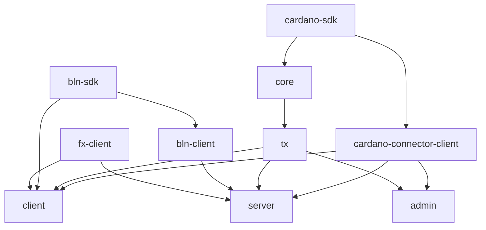

## Context

The actions that can be performed by a _consumer_ role are not really
platform-specific. In summary, a consumer can:

- open
- add
- close / unlock / end
- pay, which typically involve getting quotes and squashing.

The L1 actions (open, add, close/end) typically involve communication with a
Cardano connector. The pay/quote/squash requires communication with an Adaptor.
In both cases, the interface for interacting with both the connector and the
adaptor are fixed, which means that the logic around them will revolve around
the same steps, irrespective of the platform we execute it (browser vs
command-line).

This is currently particularly visible when comparing:

- [konduit-wasm's Channel](https://github.com/cardano-lightning/konduit/blob/245854ba784c06dbc8e71b06b43fb0abfe50ed51/rust/crates/konduit-wasm/src/channel.rs)

and

- [konduit-client](https://github.com/cardano-lightning/konduit/blob/245854ba784c06dbc8e71b06b43fb0abfe50ed51/rust/crates/konduit-client/src/main.rs);
  and
- [konduit-cli](https://github.com/cardano-lightning/konduit/blob/245854ba784c06dbc8e71b06b43fb0abfe50ed51/rust/crates/konduit-cli/src/cmd/consumer/tx.rs)

## Decision

Reduce the now-existing duplication between the wasm api and the konduit-client
/ konduit-cli w.r.t (at least) the consumer role.

So, while it is interesting to keep `konduit-tx` _pure_ (i.e. just a layer on
top of the low-level transaction builder, with no concerns of where the data
comes from); there's an apparent duplication between the wasm api and the
konduit-client + konduit-cli combo. A better split would be to:

1. Keep `konduit-client` as a library crate, with no command-line concerns
   whatsoever, but leverage interfaces for the adaptors and connectors.
2. Move the current command-line bits from `konduit-client` to `konduit-cli`,
   while trimming down the `konduit-cli` to only CLI operations. As much as
   possible the cli handlers (i.e. the concrete logic) shall live under
   `konduit-client`. The two main responsibility of the cli then becomes:
   gathering arguments and displaying outputs.
3. Get rid of `konduit-wasm` entirely, which shall become redundant / shall be
   merged entirely with `konduit-client`.

Note that while this particular document focuses on the _consumer's_
perspective, the same reasoning can (and shall) apply to the other roles.

In essence, I am proposing a different split (more practical IMO) than the
current cardano vs adaptor split: at the moment, konduit-client has no
cardano-specific elements, while konduit-tx and konduit-cli does. This split
naturally happens due to the nature of the actions (pay / quote / squash do not
require anything Cardano). It might be interesting to conserve it within the
client (if only to allow building and using the client in a 'headless mode',
without any cardano-specific features) but at the _feature level_.

## Discussion, Counter and Comments

@waalge: `konduit-tx` and `konduit-cli` are already "role oriented".
`konduit-server` is a role specific crate. Extending the proposal: I suggest we
lean into this entirely:

- `core` - shared and or fundamental types (currently `data`)
- `client` - consumer
- `server` - adaptor

Whether the platform-wrapping is feature flagged or separate crate or something
else.

## Consequences

- Having the client rely only on specified interfaces (connector, adaptor) means
  that it is easier to mock them for testing.

- We also get "free testing" by having client applications rely on that exact
  same code for their e2e flow.

- By trimming the command-line down to arg parsing and arg display, we also make
  the command-line testing straightforward (no logic whatsoever). End-to-end
  testing the command-line could be interesting but is vastly alleviated by
  static typing already.
