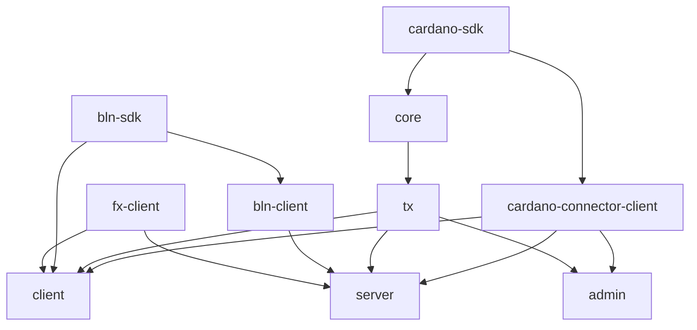

## Context

Konduit fundamentally distinguishes user roles. Participants of a channel cannot
execute the same (type of) steps (ie L1 actions). More precisely, for a channel
in stage:

- "Opened". Consumer can Add or Close, while Adaptor can Sub.
- "Closed". Consumer can Elapse, while Adaptor can Respond.
- "Responded". Consumer can Expire or End, while Adaptor can Unlock.

This is in contrast to traditional BLN where channels are symmetric:
participants can execute the same steps. Off-chain, Konduit assumes that Adaptor
is running HA infra, while Consumer is running a lightweight mobile app.

Current design factors code in terms of:

- shared components `konduit-data`
- tx building functions `konduit-tx`
- cli interface for building txs `konduit-cli`

The code organization had already coalesced around being role based, albeit
under these top level crates. In a sense, the code is first "concern oriented"
or "platform oriented" then "role oriented". The appearance of role specific
crates, `konduit-server` and `konduit-client`, brought further evidence that the
current factorization is suboptimal.

Furthermore, there is growing duplication between crates. For example, the
consumer L1 actions (open, add, close/end) typically involve communication with
a Cardano connector. The pay/quote/squash requires communication with an
Adaptor. In both cases, the interface for interacting with both the connector
and the adaptor are fixed, which means that the logic around them will revolve
around the same steps, irrespective of the platform we execute it (browser vs
command-line).

This is currently particularly visible when comparing:

- [konduit-wasm's Channel](https://github.com/cardano-lightning/konduit/blob/245854ba784c06dbc8e71b06b43fb0abfe50ed51/rust/crates/konduit-wasm/src/channel.rs)

and

- [konduit-client](https://github.com/cardano-lightning/konduit/blob/245854ba784c06dbc8e71b06b43fb0abfe50ed51/rust/crates/konduit-client/src/main.rs);
  and
- [konduit-cli](https://github.com/cardano-lightning/konduit/blob/245854ba784c06dbc8e71b06b43fb0abfe50ed51/rust/crates/konduit-cli/src/cmd/consumer/tx.rs)

## Decision

### `konduit-tx`

Role agnostic helpers and "base case" tx builder.

### `konduit-consumer`

Formely `konduit-client`. A lib that contains Consumer oriented L1 and L2
"clients", together with the logic of managing channels from the perspective of
Consumer. A platform target is wasm, but the explicit wrappers are in
`konduit-wasm`. A cli interface is feature flagged, and simply a wrapper of the
lib that gathers args, and displays output.

### `konduit-adaptor`

Formely `konduit-server`. Much as it is at the moment. The role specific tx
builder is migrated the crate, and a secondary executable expose much the same
functionality as the current CLI when run as adaptor.

### `konduit-core`

Formerly `konduit-data`. `core` seems more fashionable in rustland to `data`. So
while doing a top level renaming it seems as good as time as any to fit in with
this.

## Discussion, Counter and Comments

### Previous version

Author: @KtorZ

Reduce the now-existing duplication between the wasm api and the konduit-client
/ konduit-cli w.r.t (at least) the consumer role.

So, while it is interesting to keep `konduit-tx` _pure_ (i.e. just a layer on
top of the low-level transaction builder, with no concerns of where the data
comes from); there's an apparent duplication between the wasm api and the
konduit-client + konduit-cli combo. A better split would be to:

1. Keep `konduit-client` as a library crate, with no command-line concerns
   whatsoever, but leverage interfaces for the adaptors and connectors.
2. Move the current command-line bits from `konduit-client` to `konduit-cli`,
   while trimming down the `konduit-cli` to only CLI operations. As much as
   possible the cli handlers (i.e. the concrete logic) shall live under
   `konduit-client`. The two main responsibility of the cli then becomes:
   gathering arguments and displaying outputs.
3. Get rid of `konduit-wasm` entirely, which shall become redundant / shall be
   merged entirely with `konduit-client`.

Note that while this particular document focuses on the _consumer's_
perspective, the same reasoning can (and shall) apply to the other roles.

In essence, I am proposing a different split (more practical IMO) than the
current cardano vs adaptor split: at the moment, konduit-client has no
cardano-specific elements, while konduit-tx and konduit-cli does. This split
naturally happens due to the nature of the actions (pay / quote / squash do not
require anything Cardano). It might be interesting to conserve it within the
client (if only to allow building and using the client in a 'headless mode',
without any cardano-specific features) but at the _feature level_.

### Comment

Author: @waalge

Note: The original "cut-off point" of `konduit-data` was:

- Enough for the types and structs required for the L2 logic to handoff to the
  L1.
- Not enough to actually build transactions.

This turned out to be a bit grey.

`konduit-tx` and `konduit-cli` are already "role oriented". `konduit-server` is
a role specific crate. Extending the proposal: I suggest we lean into this
entirely:

- `core` - shared and or fundamental types (currently `data`)
- `client` - consumer
- `server` - adaptor

```mermaid
graph TD

    %% cardano-sdk dependencies
    cardano-sdk --> cardano-connector-client
    cardano-sdk --> core --> tx

    %% konduit-data dependencies
    cardano-connector-client & tx --> client & server & admin

    bln-sdk --> bln-client --> server
    bln-sdk  --> client

    fx-client --> client & server
```

Whether the platform-wrapping is feature flagged or separate crate or something
else.

## Consequences

- Having the client rely only on specified interfaces (connector, adaptor) means
  that it is easier to mock them for testing.

- We also get "free testing" by having client applications rely on that exact
  same code for their e2e flow.

- By trimming the command-line down to arg parsing and arg display, we also make
  the command-line testing straightforward (no logic whatsoever). End-to-end
  testing the command-line could be interesting but is vastly alleviated by
  static typing already.
