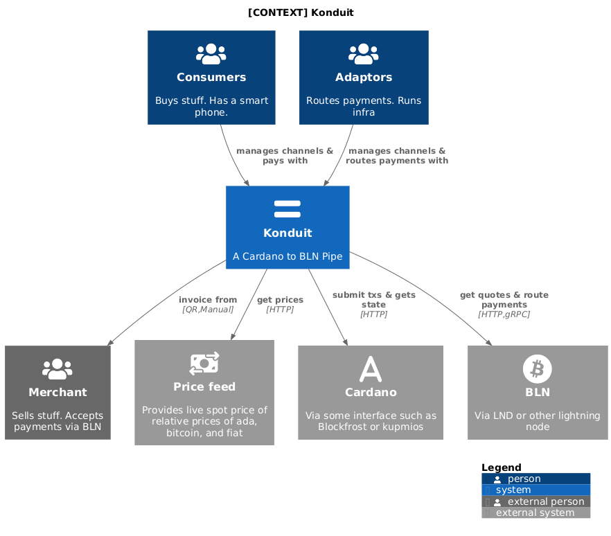
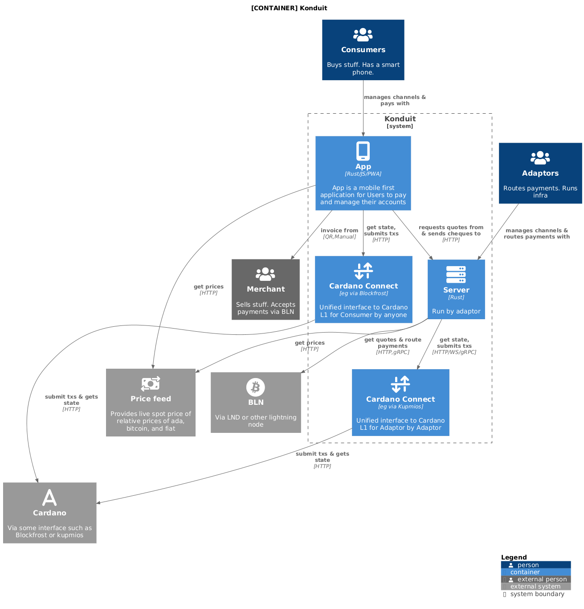
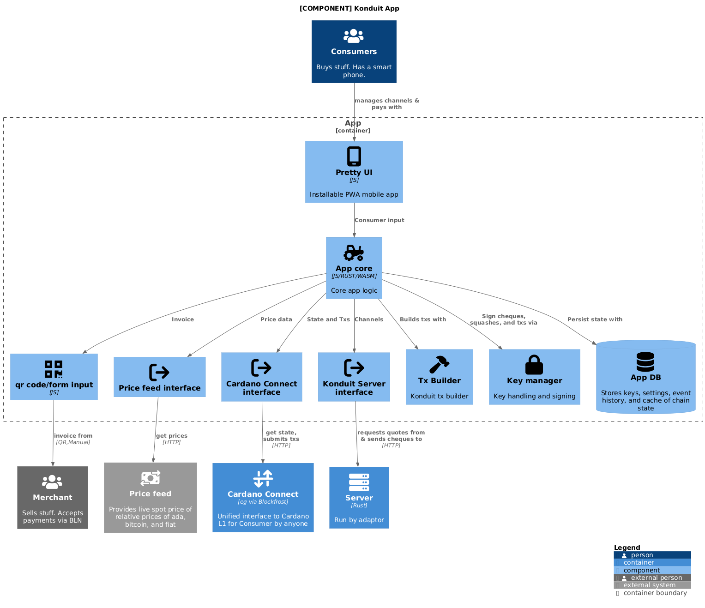
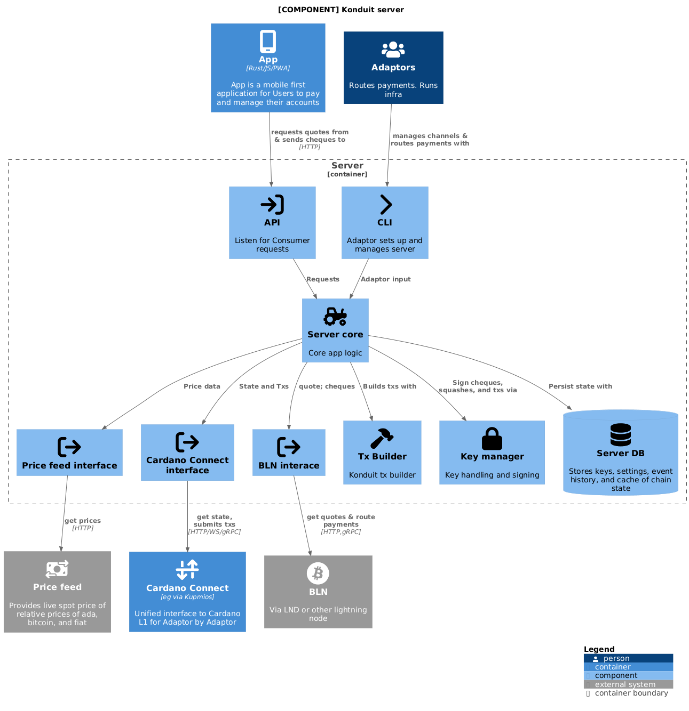

The following loosely adopts the [c4 model](https://c4model.com/abstractions)
conventions.

```
Software System >> Containers >> Compontents >> Code
```

## Context



## Container



## Components

### App



### Server


