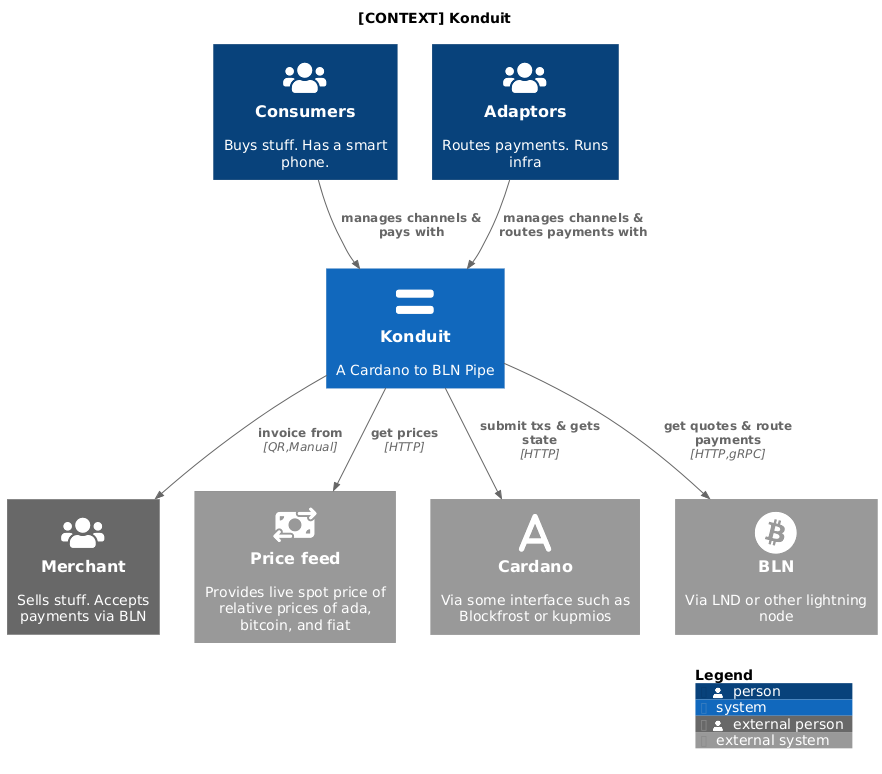
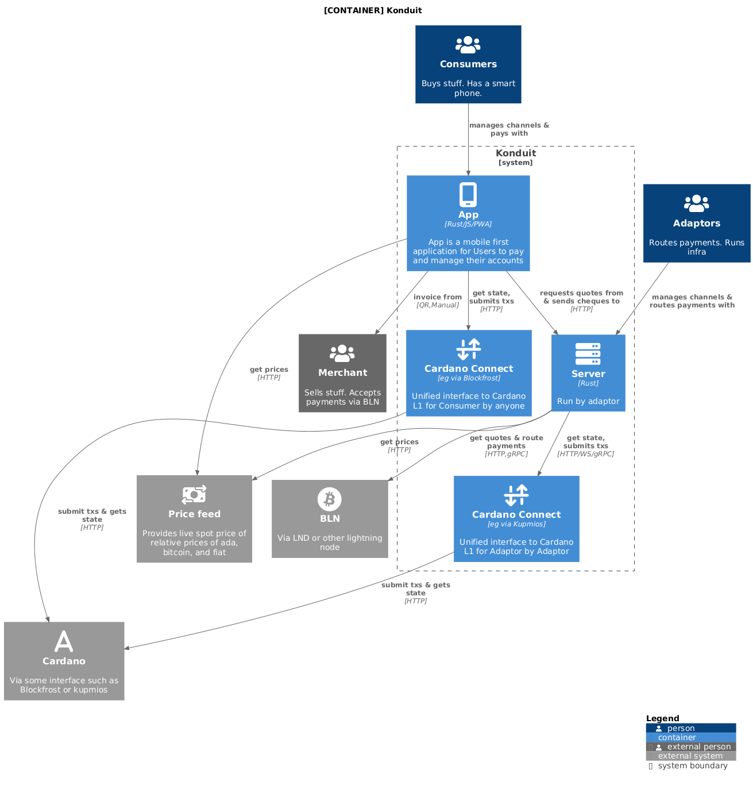
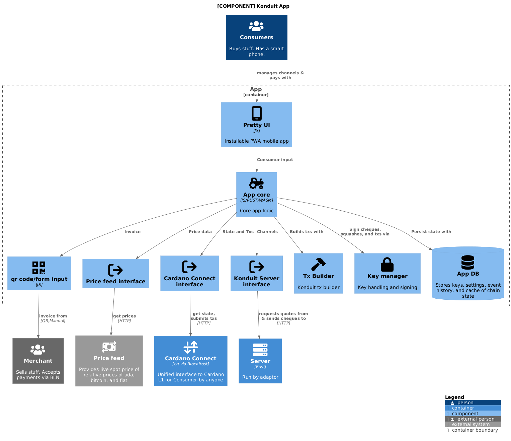
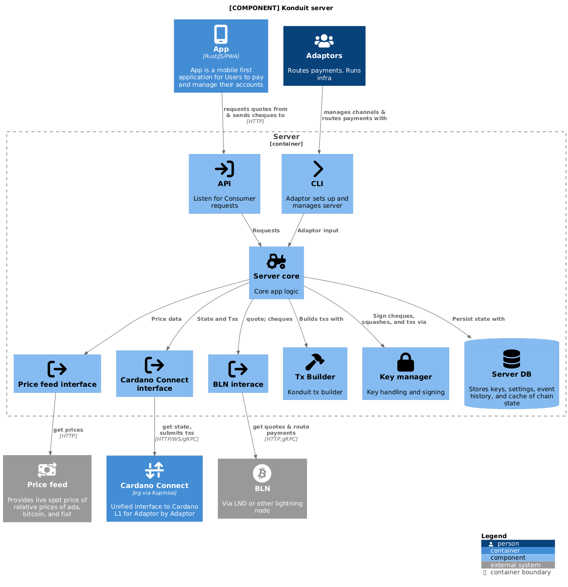
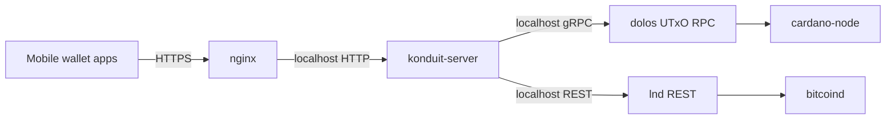

The following loosely adopts the [c4 model](https://c4model.com/abstractions)
conventions.

```
Software System >> Containers >> Compontents >> Code
```

## Context



## Container



## Components

### App



### Server



## Production Adaptor Deployment for self-hosting

The target production deployment is a single Ubuntu host running local
Bitcoin, Lightning, and Cardano services under `systemd`.


```mermaid
flowchart LR
    wallets[Mobile wallet apps]
    nginx[nginx]
    konduit[konduit-server]
    dolos[dolos UTxO RPC]
    lnd[lnd REST]
    cnode[cardano-node]
    bitcoind[bitcoind]

    wallets -->|HTTPS| nginx -->|localhost HTTP| konduit
    konduit -->|localhost gRPC| dolos
    konduit -->|localhost REST| lnd
    dolos --> cnode
    lnd --> bitcoind
```

### Trust boundaries

- Only `nginx` is public.
- `konduit-server`, `dolos`, and `lnd` remain localhost-only.
- `cardano-node` and `bitcoind` are infrastructure dependencies and are not part
  of the public API surface.

### Operational boundaries

- `nginx` handles TLS termination and request shaping.
- `konduit-server` handles consumer-facing adaptor logic.
- `dolos` is the Cardano data and submission boundary.
- `lnd` remains the Lightning and Bitcoin-facing backend for Konduit.
