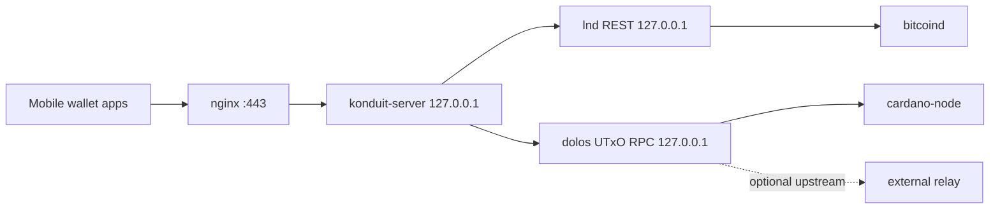

# Overview

This document describes a recommended production deployment profile for a
Konduit adaptor running on a single Ubuntu 24.04 host that already operates:

- `bitcoind`
- `lnd`
- `cardano-node`

The deployment profile described here adds:

- `dolos` as a local Cardano data service.
- `konduit-server` as the adaptor service.
- `nginx` as the public TLS terminator and rate-limiting reverse proxy.

## Goals

- Keep the public surface area minimal.
- Use localhost-only links between internal services.
- Use `systemd` native processes rather than containers.
- Keep operational boundaries clear between Cardano, Lightning, and the public
  API.
- Support deliberate manual upgrades and rollbacks.

## Scope of this document

This document describes one concrete adaptor deployment profile:

- single-host Ubuntu deployment
- `systemd` managed services
- local `dolos` for Cardano connectivity
- local `lnd` for Lightning connectivity
- `nginx` as the public reverse proxy

It should not be read as the only valid Konduit deployment model. Other
deployments may choose different Cardano backends, different reverse proxies, or
different runtime packaging depending on operator needs.

This deployment document is scoped to the adaptor runtime and its operator
tooling. It should not be read as implying repo-wide backend migration for
unrelated repository subprojects.

## Runtime Topology

## Exposure Model

Public:

- `nginx` on `443/tcp`

Loopback only:

- `konduit-server`
- `dolos` gRPC / UTxO RPC
- `lnd` REST
- admin API for Konduit

Not directly exposed by this project:

- `cardano-node`
- `bitcoind`

## Service Accounts

Recommended local users:

- `konduit`
- `dolos`

Recommended ownership model:

- installed binaries owned by `root`
- runtime state owned by the corresponding service account
- secrets readable only by the service that needs them

## Filesystem Layout

One workable layout is:

- `/opt/konduit/` for installed Konduit artifacts
- `/etc/konduit/` for configuration and environment files
- `/var/lib/konduit/` for Konduit durable state
- `/opt/dolos/` for installed Dolos artifacts
- `/etc/dolos/` for Dolos configuration
- `/var/lib/dolos/` for Dolos storage

The repository checkout used for building does not need to be the runtime path.

## Secrets

Konduit secrets include:

- adaptor signing material
- Konduit environment file
- dedicated LND macaroon
- LND TLS certificate if required by the client path

Secret handling rules:

- do not keep runtime secrets inside the Git checkout
- do not grant `konduit` access to broader LND credentials than necessary
- keep Dolos and Cardano material separate from Konduit secrets unless strictly
  necessary

## LND Access

Konduit should use a dedicated least-privilege macaroon with only the
permissions required by the adaptor flow.

Current expected permission envelope:

- `info:read`
- `offchain:read`
- `offchain:write`

`admin.macaroon` should not be used for this deployment.

## Dolos Role

In this deployment profile, `dolos` is the Cardano service boundary for
Konduit.

Responsibilities:

- answer Cardano UTxO queries through UTxO RPC
- provide live protocol parameters and related Cardano facts through UTxO RPC
- submit Cardano transactions
- remain localhost-only

For this deployment profile, Konduit should treat Dolos UTxO RPC as the
authoritative source for the Cardano data it needs at runtime.

Current compatibility requirement:

- Konduit's UTxO RPC startup path depends on Dolos successfully serving
  `read_genesis` so the live network can be derived and validated before startup
  continues.

Non-goals for this deployment:

- replacing `cardano-node`
- replacing `Ogmios` or `Kupo` for other workloads
- defining backend parity requirements for unrelated repository subprojects

## systemd Layout

Expected units:

- `bitcoind.service`
- `lnd.service`
- `cardano-node.service`
- `dolos.service`
- `konduit.service`
- `nginx.service`

Suggested ordering:

- `dolos.service` after `cardano-node.service` when the same-host node is used as
  its upstream peer
- `konduit.service` after `lnd.service` and `dolos.service`
- `nginx.service` after `konduit.service`

Suggested hardening for `dolos` and `konduit`:

- `NoNewPrivileges=true`
- `PrivateTmp=true`
- `ProtectHome=true`
- `ProtectSystem=strict`
- `RestrictSUIDSGID=true`
- `LockPersonality=true`
- narrowly scoped `ReadWritePaths=`

## Reverse Proxy

`nginx` is the recommended proxy for this deployment profile because:

- it is already familiar to the operator
- it has a strong request-shaping and rate-limiting story
- it fits anonymous public API exposure well

Recommended proxy controls:

- TLS termination
- per-IP rate limiting
- connection limiting
- request body limits
- upstream timeout tuning
- path-based exposure of only the consumer-facing endpoints

Admin endpoints should not be proxied publicly.

## Operations

Deployment workflow:

1. pull and inspect desired source revision
2. build from a pinned commit SHA
3. run targeted verification
4. install new binary / config
5. restart service
6. confirm health before considering rollout complete

Rollback workflow:

1. stop `konduit.service`
2. restore prior known-good binary and config
3. restart `konduit.service`
4. verify health through localhost and proxy checks

## Observability

Minimum recommended observability:

- `journalctl` visibility for `dolos` and `konduit`
- nginx access/error logs
- health probes for Konduit backend dependencies
- explicit checks that Dolos and LND remain reachable on localhost
- explicit checks that Konduit startup validation succeeded for network,
  protocol parameters, and reference script resolution

## Open Items

- exact `systemd` unit files remain implementation work
- exact Konduit env var values remain deployment-specific, but the current Rust
  runtime surface is `KONDUIT_CARDANO_BACKEND`,
  `KONDUIT_BLOCKFROST_PROJECT_ID`, `KONDUIT_UTXORPC_URI`, and
  `KONDUIT_NETWORK`
- rate-limit values should be tuned based on real traffic and latency
- exact readiness/health endpoint shapes remain implementation work, but should
  reflect startup blockers for Dolos reachability, network match, live protocol
  parameters, and reference script availability
- the current background admin-sync log `insufficient total gain` is an
  operational warning after successful startup, not a readiness failure
