# Overview

The _kernel_ refers to the "on-chain" part: the kernel of integrity of the dapp.

This document goes through:

- High level design of the kernel
- A description components in terms of datatypes and well-formed-ness
- A description of how batching works
- A specification of each step
- A description of typical transactions

# Design

## Overview

The "kernel" refers to the "on-chain" part. The Konduit kernel consists of a
single validator. Any (well-formed) UTXO at the validator address holds the
funds and on-chain data corresponding to a channel. And conversely any (staged)
channel corresponds to a single UTXO at tip at the validator address.

## Influence

The design of the Konduit Kernel draws heavily on previous work of
[Subbit.xyz](https://subbit.xyz/), and
[Cardano Lightning](https://cardano-lightning.org). Both protocols are built on
two party payment channels, the former is unidirectional, while the latter is
bidirectional with HTLC support. Konduit is unidirectional with HTLC support.

## Channel life-cycle

The life-cycle of a channel

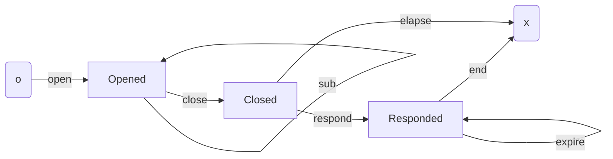

Nodes are **stages**; arrows are **steps**.

Consumer wishes to pay Merchants via BLN. After App Setup, Consumer can `open` a
channel with Adaptor. The `open` locks Consumer funds on the L1. These funds
underwrite the payments Adaptor makes on the behalf of Consumer on BLN.

Off-chain, Consumer sends Adaptor a "null squash" as part of their initial
handshake. While the channel is open, Consumer can make payments to BLN via
Adaptor. This happens off-chain aka the L2. The details of the exchanges and
their context are elsewhere. The important aspects are:

- When initiating a pay, Consumer sends Adaptor a "cheque"
- When resolving a pay Adaptor will request Consumer "squash" cheques into a
  single piece of data.

Adaptor constructs a "receipt" as evidence of funds owed. Adaptor can use this
evidence in a `sub` step.

As and when Consumer desires, Consumer can `add` additional funds to the
channel.

When Consumer no longer wishes to continue their engagement with Adaptor, they
`close` the channel. Funds remain locked. This begins a time window,
`close_period`, during which Adaptor can `respond` with their final receipt.
Adaptor will stop handling new Consumer requests when they see the channel is
`closed`. There is no risk to Adaptor, so long as they watch the chain more
frequently than once every respond period.

The Adaptor has evidence they are owed funds as in a `sub`. However, at the time
of the `respond` it may yet be determined which of the pair is the rightful
owner of the funds associated to cheques. We say these are pending cheques.

If Adaptor has no pending cheques then they are able to take all funds owed
immediately. If Adaptor has some pending cheques these are held until a point in
time where either:

- Consumer demonstrates that a cheque has expired,
- Adaptor unlocks the cheque by providing the secret.

In either case, the participant removes the funds they are owed. Note, during
the respond, Consumer may remove all funds not associated to a pending cheque.
When there are no remaining cheques, Consumer `end`s the channel.

If Consumer `close`s and Adaptor fails to `respond` within the time period, they
are deemed to have abandoned their obligation. From `closed`, Consumer can
`elapse` the channel if the respond period has expired, again retrieving all
remaining funds.

## Motivations

### Batching

Batching steps of multiple channels into single txs is first class in the
design. It makes maintaining many channels as Adaptor (or Consumer) easier and
cheaper.

### Mutual txs

Mutual txs allow partners of a channel to perform an arbitrary spend. Provided
both consent, by signing the tx, anything goes.

Mutual txs are uninteresting from the perspective of validators, since it is
effectively a multisig. An additional constraint is that a mutual tx must
include no other inputs from validator address. This simplifies the batching
case.

### Simplifications from CL

- In the initial iteration we remove the possibility of (non ada) native asset
  channels.
- Only `Sha2_256` locks are available (cf Cardano Lightning with support for
  other lock types).
- For Konduit, a "Cheque" has a hash and timeout. There is no notion of a cheque
  without this.

### HTLCs

Hashed Time-Locked Contract, HTLC, is the fundamental component of what makes
Lightning safe. In Bitcoin, the term HTLC is used not only as the general
mechanism but also as an address, a contract to which the address corresponds,
an output associated to an address, or a family of such things. Here we use it
to mean the general mechanism. A warning: The implementation of HTLC looks quite
different to that of Bitcoin.

For more details, see
[interledger](https://interledger.org/developers/get-started/).

## Conventions

Some type aliases used, that are not Konduit specific:

```aiken

/// Index is used to enumerate a collection
pub type Index =
  Int

/// Amount is used for value
pub type Amount =
  Int

/// Timestamp is used to for posix time
pub type Timestamp =
  Int

// Posix Timestamp
/// Type alias for Bytearray to indicate that this ought to be of a given length.
pub type Bytes32 =
  ByteArray

pub type Bytes64 =
  ByteArray

/// Signature is used where the value is the output of a sign function.
/// It is 64 bytes in length
pub type Signature =
  Bytes64
```

Throughout the document "channel" refers to the UTXOs in which the associated
funds of a channel (more generally speaking) are locked. This usually means the
UTXO at tip at the implied point in time, eg when the transaction is being
executed. There is a notion of "continuing output", which may also be referred
to as the channel. In context, we hope it clear exactly to what it is we are
referring.

Participants are identified by their key, and signatures therefrom. We use the
prefixes:

- `add` - Belongs to Consumer
- `sub` - Belongs to Adaptor

We use the suffixes:

- `skey` - Signing key
- `vkey` - Verification Key
- `vkh` - Verification Key Hash

For examples:

- `add_vkey` is Consumer's verification key.
- `sub_vkh` is Adaptor's verification key hash.

# Components

## Signing

There are two components that require signatures, namely cheques and squashes
(see below). From the perspective signing, they are treated identically.

Suppose we have four bytearrays:

```
body, signature, tag, key
```

We say that `(body, signature)` is **well-formed**, or **well-signed**, with
respect to pair `(tag, key)` if

```
verify(key, concat(tag, (serialize(cheque_body)), signature)
```

Where `verify` is the signature verification function.

A Konduit channel instance has a fixed value for `tag` and `key` for its entire
lifecycle. Thus, in the context of channel, the "with respect to" is implicitly
understood.

## Cheque

Cheques are a vehicle by which funds are sent from Consumer to Adaptor. Cheque
is the key datatype by which the HTLC mechanism relies on. A cheque corresponds
to a channel, and is created by Consumer and sent to Adaptor.

The data definition is as follows

```aiken
type Timeout = Timestamp
type Lock = Bytes32
type ChequeBody = (Index, Amount, Timeout, Lock)
type Cheque = (ChequeBody, Signature)
```

More precisely a cheque is associated the pair `(tag, key)`. In theory there can
be multiple channels with the same tag and key. However, this puts only the user
providing the funds at risk. We reiterate a warning that Consumer should not
reuse `(tag, key)` unless they absolutely know what they are doing.

We say a cheque `(body, signature)` is **well-formed** if it is well-signed.

When Adaptor receives a cheque they must verify it is well-formed. Note there
are many other reasons Adaptor may reject a cheque. For example:

- Non positive index
- Reuse of index
- Amount not underwritten by channel
- Insufficient time before timeout _etc_

These are conditions to established by Adaptor as part of their L2.

The timeout is still important on the L1. In practice this verification is
postponed. Thus, we say a cheque is well-formed **subject** to an upper bound
`bound` if is well-formed, and the `bound` is `<= timeout`.

## Unlocked

To use a cheque as proof of funds owed, the receiver must provide the "secret".
A secret is a bytearray that hashes (sha2 256) to the lock. Moreover, it must be
32 bytes in length

```aiken
type Secret = Bytes32
type Unlocked = (ChequeBody, Signature, Secret)
```

We say that an unlocked `(body, sig, secret)` is **well-formed** with respect to
the pair `(tag, vkey)`, subject to an upper bound `bound` provided that:

- unlocked.0 : `(body, sig)` is well-signed
- unlocked.1 : the secret hashes to the lock
- unlocked.2 : the secret length is 32

## Squash

Each pay action issues a new cheque on the L2. Adaptor can use the cheque and
secret directly on the L1 without Consumer involvement, however they must do so
before the timeout expires.

It is likely preferable for Consumer to provide an alternative redemption
mechanism that removes the time lock. The funds associated to a collection of
cheques can be "squashed" in to a much smaller piece of data, namely a `Squash`.

```aiken
type Exclude = List<Index>
type SquashBody = (Amount, Index, Exclude)
type Squash = (SquashBody, Signature)
```

Unlike CL we do not need to "Snapshots", which are the pair squashes one of each
participant, since only Consumer is issuing cheques.

A squash is **well-formed** if:

- squash.0 : It is well-signed
- squash.1 : The index `n >= 0`
- squash.2 : The exclusion list is strictly monotonically increasing with values
  in
- squash.3 : `(0, n)` (ie positive numbers strictly less than the index).

Otherwise the squash is ill formed. Consumer must only make well-formed squash.
Adaptor must reject ill-formed squash. Failure of either participant to do so
may put their funds at risk. Warning. We do not explicitly verify the
well-formedness of squash in the kernel. Both participants have to consent to
the use of an ill-fromed squash, so both are responsible for the consequences.

A cheque is **accounted for** in a squash if its index `<= Index` and it does
not appear in the `Exclude` list.

## Receipt

Before Adaptor routes any cheques from Consumer, they must receive the initial
squash. This can be empty squash, with body `(0,0,[])`, declaring no value is
yet owed.

In a `sub` Adaptor presents evidence of funds owed. The evidence is a `Receipt`.

```aiken
type Receipt =  (Squash, List<Unlocked>)
```

A receipt is **well-formed** if:

- squash is well-signed
- each unlocked is well-formed
- each unlocked is unaccounted for in the squash

Unlike the cheques or squash, a receipt is both constructed and submitted by
Adaptor. The L1 must verify the well formed-ness of the receipt. We subsume the
well-fromedness logic into accounting.

To account a receipt:

- receipt.0 : Squash is well-signed
- receipt.1 : Each unlocked is well-formed subject to a bound
- receipt.2 : Each unlocked index is strictly increasing and unaccounted for
- receipt.3 : Return total owed and least bound if any

The cumulative amount `subbed` from the channel is what is recorded in the
channel datum (see below). In a sub step, Adaptor can redeem no more than the
difference between `owed` and `subbed`. The new cumulative amount `subbed` is
what the continuing output records.

## Mixed Cheques

At the instance end of life, Consumer may close while some cheques are neither
timed out or had their secret revealed. Thus we need to accommodate yet to be
determined evidence. Enter mixed cheque: either an unlocked or (locked) cheque.

```aiken
type MixedCheque {
    MUnlocked(..Unlocked)
    MCheque(..Cheque)
}
```

The `Mix` is a mix of unlocked cheques and pending cheques.

A mixed cheque is **well-formed** provided that whatever it is wrapping is
well-formed.

Our choice of vocab is close to that of Cardano Lightning, but with some
divergence. Konduit is simpler. For example:

- There is no "normal" cheque. Instead Consumer issues a squash. See below.
- There are no other locks, so the data structure of the locked cheque is
  simpler. We only support the lock present on BLN.

## Mixed receipt

A mixed receipt, as name suggests, is the equivalent to receipt but with
`MixedCheque`s. In a `respond` Adaptor includes also cheques yet to be
determined:

```aiken
type MReceipt =  (Squash, List<MixedCheque>)
```

The well-formedness of an MReceipt is analogous to those above.

To account `MReceipt` is similar to that of `Receipt` but must also handle the
yet to be determined cheques. Pending cheques persist in the instance on-chain
until on of the participants can demonstrate the funds are theirs.

Account for `MReceipt` as follows:

- m-receipt.0 : Squash is well-signed
- m-receipt.1 : For each mixed:
- m-receipt.1.0 : If unlocked then is well-formed subject to bound
- m-receipt.1.2 : If cheque then is well-formed and appears on continuing output
- m-receipt.1.3 : Either case, Index is strictly increasing and unaccounted for
- m-receipt.2 : There no additional pending cheques
- m-receipt.3 : Return total owed and least bound if any

## Unpending

All pending cheques will eventually be resolved, either by:

- Adaptor unlocking with a secret, or
- Consumer demonstrating timeout

In either case, the participant doing the step provides a `List<ByteArray>`. If
the entry is non-empty the item is popped from the list. In the case of `unlock`
the bytearray must be the secret.

Adaptor can unlock amounts they can demonstrate they are owed, while Consumer
can remove all funds _not_ possibly belonging to Adaptor.

## Datum and Redeemer

```aiken
type Constants {
  tag : Tag,
add_vkey : VerificationKey,
  sub_vkey : VerificationKey,
  close_period : Int,
}

/// ScriptHash is own_hash
type Datum = (ScriptHash, Constants, Stage)

/// Pend cheques are Cheque body but without the Index since its not needed
type Pending = (Amount, Timeout, Secret)

/// Stage
/// Opened ( subbed_amount )
/// Closed ( subbed_amount, elapse_at )
/// Responded ( locked_amount, pending )
type Stage {
  Opened(Amount)
  Closed(Amount, Timestamp)
  Responded(Amount, List<Pending>)
}

type Redeemer {
  Defer
  Main(Steps)
  Mutual
}

type Step {
  StepCont(Cont)
  StepEol(Eol)
}

type Steps = List<Step>


/// Unpends
type Unpending = List<Bytearray>

type Cont {
  Add
  Sub(..Receipt)
  Close
  Respond(..MReceipt)
  Unlock(Unpending)
  Expire(Unpending)
}

type Eol {
  End
  Elapse
}
```

# Validator

## Overview

The kernel consists of a single validator which is invoked exclusively with
spend purpose.

There are two "kinds" of permitted transaction:

- Batch: The primary kind of transaction, even if only one channel is involved.
- Mutual: The secondary kind of transaction. Both participants consent via
  signing the transaction.

Konduit channels are independent of one another. The validator logic maintaining
channel correctness in a transaction _should_ pose an
[embarassingly parallel](https://en.wiktionary.org/wiki/embarrassingly_parallel)
problem.

However, in Cardano each UTXO at a script address spent in the transaction
triggers an execution of the spend validator. When [batching](#batching), this
is the same script many times. Even with passing in the input and output
indicies of each channel as part of the redeemer still results in multiple
traverses over the same list.

It is in the interests of efficiency that all constraints are enforced on the
"first", ie "main", execution of the script. All other "defer" executions check
only that the validator has already executed as "main".

The validator logic is structured roughly as follows. If the redeemer is:

- "Defer" then find "Main" and return
- "Main" then
  - Fold over steps, each time yield own input
    - If the step is continuing:
      - Yield continuing output
      - Do step logic with input and continuing output
    - Else (step is end-of-life):
      - Do step logic with input
  - Verify signers and validity range
  - No more own input
- "Mutual" then
  - Both partners signed
  - Unique own input

Note that the Konduit business logic is almost entirely taking place in the "do
steps" parts. "Almost entirely" since other parts are making use of Konduit data
types, and, for example, the verify signers and validity range is relevant to
Konduit business logic. On this observation, the validator is arranged into two
parts:

- BL specific ie the "do steps" part
- BL agnostic ie everything else.

Recall that inputs are lexicographically sorted. The declared steps in the Main
redeemer and the transaction outputs must align with this ordering.

This design introduces additional "what happens if...?!" cases that require
careful consideration. Recall that the validator is not responsible to ensure
the safety of a users funds from themselves, only their funds from others.

## BL Agnostic

Unless stated otherwise:

- datums are inline
- UTXO reference script field is empty

### Redeemers

#### Defer

In a standard tx, all but one of the script inputs are spent with `Defer`. More
precisely, the lexicographical first validator input in the tx inputs must have
redeemer `Main`, and all the rest are spent with `Defer`.

The logic when the redeemer is `Defer`:

- defer.0 : First script input `main_input` is not own input
- defer.1 : `main_input` datum has correct `own_hash`

#### Main

In a standard tx, the "main" invocation does all the verification steps for all
channels.

The logic when the redeemer is `Main(steps)`:

- main.0 : Own input has correct `own_hash`
- main.1 : Extract `bounds`, and `extra_signatories`,
- main.2 : Fold over `steps`. The fold aggregates: list of required signers,
  greatest lower bound, and least upper bound
- main.4 : All signers have signed
- main.5 : If greatest lower bound, then this is less than tx lower bound
- main.6 : If least upper bound, then this is greater than tx upper bound
- main.7 : No more own inputs

The fold consumes the steps that need to be verified. Each step verification
requires some context, which varies subtly between them. All steps require some
info from the channel input, and if a continuing step then the continuing
output,

- fold.0 : with step, yeild own input
- fold.1 : if step is continuing
  - fold.1.0 : yield continuing output
  - fold.1.1 : verify step
- fold.3 : else
  - fold.3 : verify step

#### Mutual

A channel can be spent by mutual consent with no further verification on the
channel itself. In such cases, it is spent with the `Mutual` redeemer. To
prevent exploits, and by the way `Defer` and `Main` interplay, we prevent any
other channels spent alongside a `Mutual` spend.

- mutual.0 : Both participants sign
- mutual.1 : Unique own input

### IO

The kernel traverses inputs and outputs via "yield" functions.

#### Yield in

The inputs of interest are those residing at the script. These are identified by
the `input.output.address.payment_credential` being equal to the script
credential.

On each call, the next own input is found, the datum coerced and extracted, and
the relevant fields passed back (via CPS).

- yin.0 : Split next `[input, ..rest]`, else fail
- yin.1 : If own input (on payment credential), then
  - yin.1.0: Coerce datum.
  - yin.1.1: Expect equal datum own hash
  - yin 1.2: Yield address, value, constants, stage, rest
- yin.2 : Else, recurse with rest

#### Yield out

The outputs of interest are again those residing at the script, however the
verification is more involved.

An output of interest is alwasy a continuing output. It must have the same
address, including stake part, as the corresponding input. Moreover, the
`constants` component of the datum is also verified within the yield logic.

- yout.0 : Split next `[output, ..rest]`, else fail
- yout.1 : If output has matching address, then
  - yout.1.0: Coerce datum.
  - yout.1.1: Expect equal datum own hash
  - yout.1.2: Expect equal datum constants
  - yout 1.3: Yield address, value, constants, stage, rest
- yout.2 : Else, recurse with rest

### Assets

The current version of konduit supports only Ada.

Input amounts are found "permissively", while output amounts are "strict".

## Steps (aka BL Specific)

The BL agnostic part provides the correct execution context for the "do step"
logic. The "do step" context provides the following arguments:

- `constants`, `c` - Channel constants
- `stage_in`, `s_in` - the stage of the input
- `value_in`, `v_in` - the value of the input
- `stage_out`, `s_out` - the stage of the continuing output
- `value_out`, `v_out` - the value of the continuing output
- Additional arguments from the redeemer if relevant

Every step "returns" (via CPS) three values:
`verification_key, lower_bound, upper_bound`. The time bounds are optional and
only relevant in some steps.

These are aggregated over all channels in the transaction. It is then verified
that the transaction has the necessary required signers, and the validity range
is within the bounds required by the steps. This is handled by the BL agnostic
part.

Throughout we use the following conventions:

- Field names as variable names
- A trailing slash on variable `var_` is used to indicate that there is an
  expect equals on the variable of the variable (without trailing slash) ie
  `expect var == var_`

Recall that the open step does not correspond to a spend of a channel. Thus it
does not appear here.

### Add

- add.0 : Stage in is opened : `Opened(subbed)`
- add.1 : Stage out is equal to stage in `stage_out == stage_in`
- add.2 : Funds increased `value_in` < `value_out`
- add.3 : Return `(add_vkey, None, None)`

### Sub

Redeemer arguments: `receipt`

- sub.0 : Stage in is opened : `Opened(subbed_in)`
- sub.1 : Stage out is opened : `Opened(subbed_out)`
- sub.2 : Funds decrease by `subbed = value_in - value_out`
- sub.3 : Subbed amount is correct `subbed_out == subbed_in + subbed`
- sub.4 : `(owed, mbound) = account_receipt(receipt)` is well-formed.
- sub.5 : `owed >= subbed_out`
- sub.6 : Return `(sub_vkey, None, mbound)`

### Close

- close.0 : Stage in is opened : `Opened(subbed)`
- close.1 : Stage out is closed : `Closed(subbed_, elapse_at)`
- close.2 : Funds unchanged
- close.3 : Return `(add_vkey, None, Some(elapse_at - close_period))`

### Respond

Redeemer params: `m_receipt`

- respond.0 : Stage in is closed : `Closed(subbed, _)`
- respond.1 : Stage out is responded : `Responded(p_amount, pendings)`
- respond.2 : Funds decrease by `subbed = value_in - value_out`
- respond.3 : Subbed amount is correct `subbed_out == subbed_in + subbed`
- respond.4 : `(owed, mbound) = account_m(receipt, p_amount, pendings)`
- respond.6 : `owed >= subbed_out`
- respond.3 : Return `(sub_vkey, None, mbound)`

### Unlock

Redeemer params: `unpends`

- unlock.0 : Stage in is responded :
  `stage_in = Responded(pends_amount_in, pends_in)`
- unlock.1 : Adaptor has signed
- unlock.2 : Stage out is responded :
  `stage_out = Responded(pends_amount_out, pends_out)`
- unlock.3 : Funds decrease by `subbed = value_in - value_out`
- unlock.4 : Secrets are well-formed, and total `owed`
- unlock.5 : `owed >= subbed`
- unlock.6 : `pend_out` is `pend_in` adjusted for items in `unpends` being
  dropped, where each item has had secret revealed

#### Notes

Secrets must be 32 bytes. We abuse the type system in order to instruct the
validator to continue or unlock a pend cheque using a bytearray. Namely:

- `[]` : Continue pend cheque
- `<secret>` : 32 bytes unlocking current pend cheque.

We allow only each party to withdraw their own funds.

### Expire

Context : `signers`, `lower_bound`, `stage_in`, `value_in`, `stage_out`,
`value_out`

Redeemer params: `expired`

- expire.0 : Stage in is responded :
  `stage_in = Responded(pends_amount_in, pends_in)`
- expire.1 : Consumer has signed
- expire.2 : Stage out is responded
  `stage_out = Responded(pends_amount_out, pends_out)`
- expire.3 : Each item in `expired` corresponds to pending cheque that has
  expired : `<= lower_bound`
- expire.4 : `pend_out` is `pend_in` adjusted for items in `expired` being
  dropped,
- expire.5 : Funds out (locked) is `>= pend_ou`

We use the same logic as Unlock in the use of bytestrings to indicate continue
if empty, else expire.

### End

Context : `signers`, `lower_bound`, `stage_in`

- end.0 : Stage in is responded `stage_in = Responded(pend)`
- end.1 : Consumer has signed
- end.2 : All pending cheques are expired : `<= lower_bound`

### Elapse

Context : `signers`, `lower_bound`, `stage_in`

- elapse.0 : Stage in is Closed : `stage_in = Closed(_, elapse_at)`
- elapse.1 : Consumer has signed
- elapse.2 : Respond period has expired : `elapse_at <= lower_bound`.

# Txs

This section outlines the form of typical transactions. Since the dapp involves
a single validator, there isn't a great deal to be further elucidate. The
diagrams are illustrative, and hide many details such as collateral inputs.

## Open tx

Consumer deposits fund at the channel validator address. (Recall that the stake
credential of the channel address is not constrained, but is fixed over the life
of the instance).

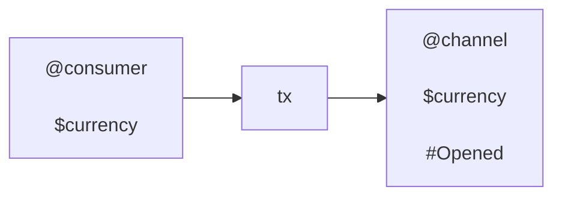

## Add tx

Consumer deposits more funds of currency `$currency` at their channel

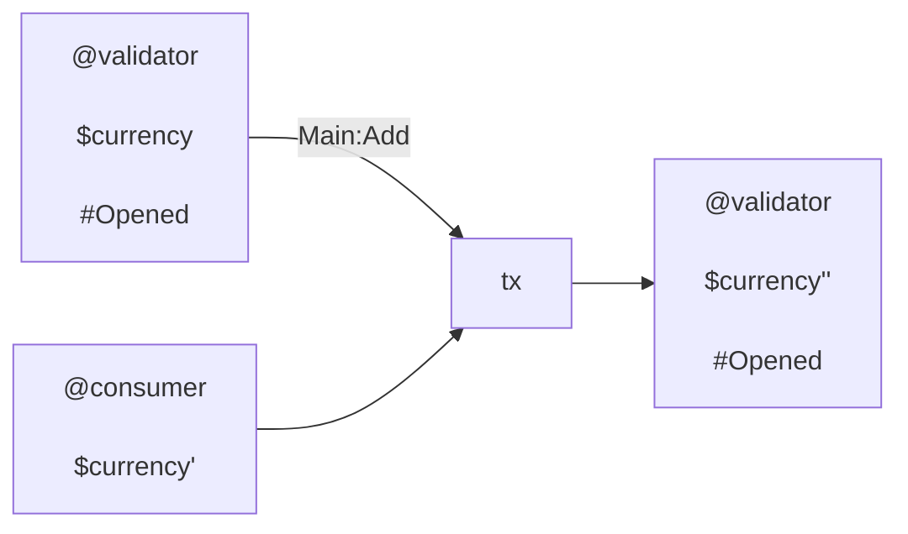

## Sub tx

Adaptor receives the amount the receipt indicates relative to the input state.
The output state is updated accordingly.

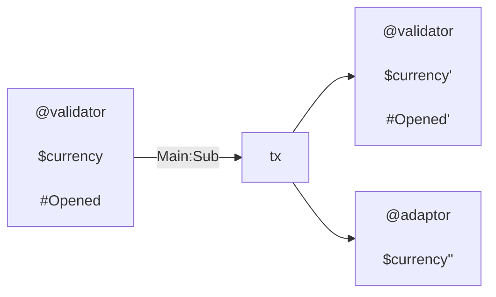

## Close tx

Consumer wishes to end their channel, and does a close

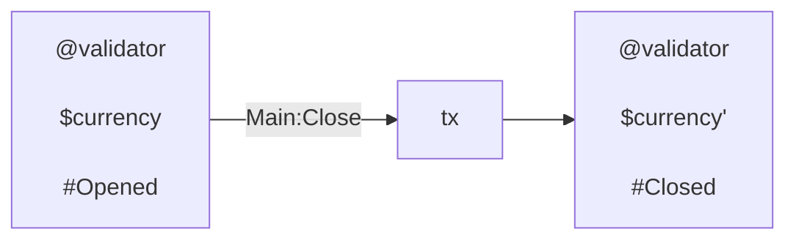

## Respond tx

Adaptor submits their final receipt. They claim funds owed, and leave locked
funds associated to pending cheques.

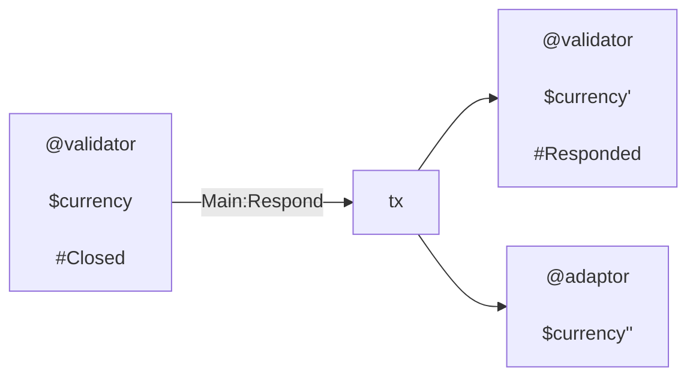

## Unlock tx

Adaptor reveals secrets associated to pending cheques. They take associated
funds.

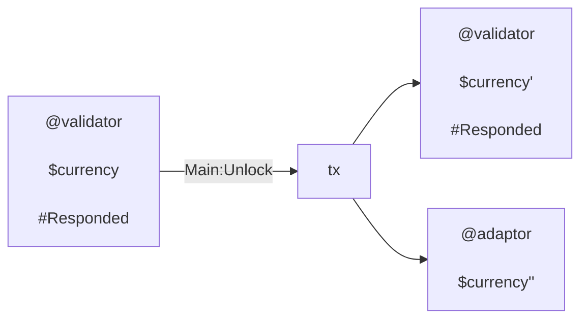

## Expire tx

Consumer submits tx pointing at the pending cheques that have expired. They take
funds demonstrably theirs.

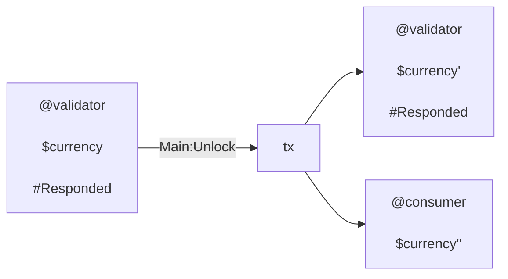

## End tx

Consumer ends a responded channel. All pending cheques are expired.

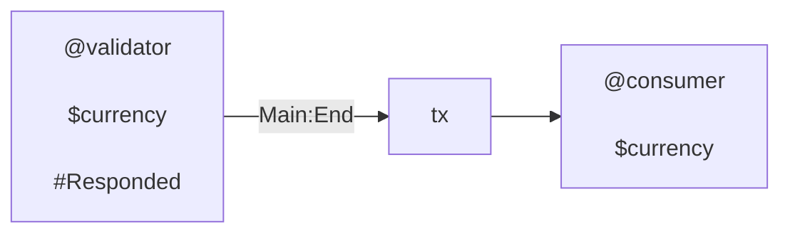

## Elapse tx

Consumer elapses a closed channel. Adaptor has submitted no final receipt in the
respond period.

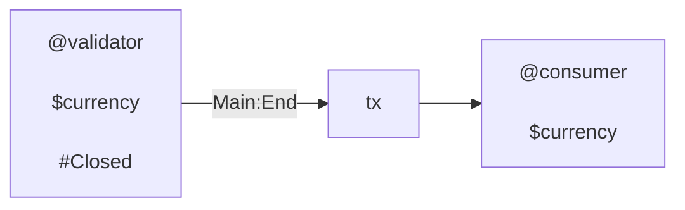

## Batch tx

A batch tx is "composition" of txs above.

FIXME: Remove multi-asset


Note that steps ordering would be

```txt
  steps = [Sub, Sub, Sub, Unlock]
```

This might be a typical tx of a adaptor. Consumer can also submit batched
channel steps. There is no restriction on which steps appears.

## Mutual tx

If Consumer and Opertator agree, they can unstage a channel on their own terms:

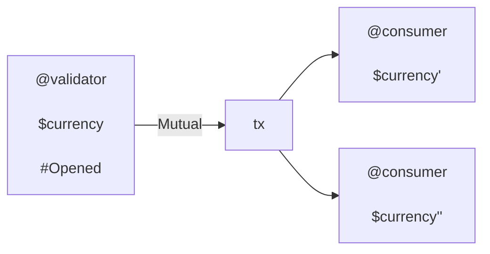

# Comments

## What happens if ...

### WHI: Duplicate tag

> ... there are channels with the same tag?

See
[tag ADR](https://github.com/kompact-io/subbit-xyz/blob/main/docs/adrs/tag.md).

### WHI: Bad own hash

> ... a channel has the wrong `own_hash`?

There is no validation on "opening" a channel, nor is there any mechanism
preventing the output of an arbitrary UTXO to the script address. A bad own hash
can occur.

Adaptor must not consider channels that are ill-formed. An ill-formed channel
can be spent with `Main` or `Defer`, potentially bypassing any verification
steps, since it will not identify channel inputs correctly.

Suppose we have a channel with incorrect `own_hash`. We say it is ill formed.
Recall we care only that a well-formed channel cannot be put at risk by a
channel that is ill-formed. That is, there is no way the inclusion of an
ill-formed input could alter the verification applied to the well-formed input.
There are multiple cases to consider: one for each redeemer type for each input.

When well-formed, ill-formed redeemers are:

1. (Mutual, Any): This is impossible. In the logic of a mutual transaction,
   there is the "solo" restriction. This ensures there are no other inputs with
   matching payment credentials. Even if this was not impossible, both
   participants of the well formed channel sign, so no funds are at risk.
2. (Any, Mutual): As in the above case, this is impossible.
3. (Main, Any): This is possible. However, the inclusion of the ill-formed input
   does not impact the verification applied to the well-formed input. In
   addition, note that a continuing output of the ill-formed input will result
   in the correct `own_hash`, since this comes from the well-formed input.
4. (Defer, Main): This is possible, however only if the well-formed input logic
   identifies a different input as main. Imporantly, this cannot be the
   ill-formed input in question, since the main `own_hash` is verified by each
   defer input. This correct main input must be spent with `Main` redeemer since
   `Mutual` and `Defer` will both fail. This recovers the case above.

It follows that such an input exists only when a consumer has spent their own
funds,  
and not those belonging to a partner. This property is in keeping with our
guiding principles of design: On-chain code keeps users safe from others, but
not necessarily from themselves. It is the role of off-chain code to keep
consumers safe from themselves.

### WHI: No main

What if there is a transaction with defer spends but no main. This is
impossible. This is touched on above.

Any defer inputs will identify a (the) main. This input cannot be spent with
defer since it would identify itself as main. This input can be spent with
mutual, but only if there are no other inputs from script. In particular no
defer inputs. Thus, as long as there is one defer input, there must be a main
input.

### WHI: Many mains

This is possible, and it's not a problem. It will cause a duplication of the
execution, and excution costs.

## Decisions without ADRs

### Time

Time in Plutus not is handled in a particularly satisfactory manner. The lack of
precision is understandable in a decentralised system. To then create a bound
with the precision of "include" or "exclude" makes little sense. And the fact
that you these may actually be constrained by mysterious ledger rules... Most
unfortunate.

All transactions must include finite bounds. This makes the design easier. This
is not necessary and potentially makes the transaction marginally more
expensive.

A more eloquent design may accumulate the constraints on bounds until the end of
the fold since some but not all steps require (finite) time bounds. A priori,
before the folding over steps, we do not know whether or not we will encounter a
step that needs a bound, or which bound it requires. This lazier evaluation
could then be ommitted if not bounds, or only one bound was required. It is
unclear whether or not this would actually be cheaper, or more then negligibly
so.
