# Design

## Influence

The design of the Konduit Kernel draws heavily on previous work of
[Subbit.xyz](https://subbit.xyz/), and
[Cardano Lightning](https://cardano-lightning.org). Both protocols are built on
two party payment channels, the former is unidirectional, while the latter is
bidirectional with HTLC support. Konduit is unidirectional with HTLC support.

## Motivations

### Batching

Batching steps of multiple channels into single txs is first class in the
design. It makes maintaining many channels as Adaptor (or Consumer) easier and
cheaper.

### Mutual txs

Mutual txs allow partners of a channel to perform an arbitrary spend. Provide
both consent, by signing the tx, anything goes.

This is uninteresting from the perspective of validators. It is effectively a
multisig. The additional constraint is that a mutual txs must include no other
inputs from validator address.

### Simplifications

- In the initial iteration we remove the possibility of (non ada) native asset
  channels.
- Only `Sha2_256` locks are available (cf Cardano Lightning with support for
  other lock types).
- For Konduit, a "Cheque" has a hash and timeout. There is no notion of a cheque
  without this.

### HTLCs

Hashed Time-Locked Contract, HTLC, is the fundamental component of what makes
Lightning safe. In Bitcoin, the term HTLC is used not only as the general
mechanism but also as an address, a contract to which the address corresponds,
an output associated to an address, or a family of such things. Here we use it
to mean the general mechanism. A warning: The implementation of HTLC looks quite
different to that of Bitcoin.

For more details, see
[interledger](https://interledger.org/developers/get-started/).

## Konduit life-cycle

The life-cycle of a Kernel instance

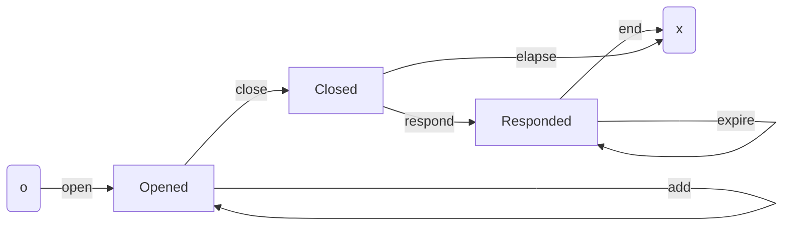

Nodes are **stages**; arrows are **steps**.

Consumer wishes to pay Merchants via BLN. After App Setup, Consumer can `open` a
channel with Adaptor. The `open` locks Consumer funds on the L1. These funds
underwrite the payments Adaptor makes on the behalf of Consumer on BLN.

While the channel is open, Consumer can make payments to BLN via Adaptor. This
happens off-chain aka the L2. The details of the exchanges and their context are
elsewhere. The important aspects are:

- When initiating a pay, Consumer sends Adaptor a "cheque"
- When resolving a pay Adaptor will request Consumer "squash" cheques into a
  single piece of data.

Adaptor constructs a "receipt" as evidence of funds owed. Adaptor can use this
evidence in a `sub` step.

As and when Consumer desires, Consumer can `add` additional funds to the
channel.

When Consumer no longer wishes to continue their engagement with Adaptor, they
`close` the channel. Funds remain locked. This begins a time window,
`close_period`, during which Adaptor can `respond` with their final receipt.
Adaptor will stop handling new Consumer requests when they see the channel is
`closed`. There is no risk to Adaptor, so long as they watch the chain more
frequently than once every respond period.

The Adaptor has evidence they are owed funds as in a `sub`. However, at the time
of the `respond` it may yet be determined which of the pair is the rightful
owner of the funds associated to cheques. We say these are pending cheques.

If Adaptor has no pending cheques then they are able to take all funds owed
immediately. If Adaptor has some pending cheques these are held until a point in
time where either:

- Consumer demonstrates that a cheque has expired,
- Adaptor unlocks the cheque by providing the secret.

In either case, the participant removes the funds they are owed. Note, during
the respond, Consumer may remove all funds not associated to a pending cheque.
When there are no remaining cheques, Consumer `end`s the channel.

If Consumer `close`s and Adaptor fails to `respond` within the time period, they
are deemed to have abandoned their obligation. From `closed`, Consumer can
`elapse` the channel if the respond period has expired, again retrieving all
remaining funds.

## Conventions

Throughout the document "channel" refers to the UTXOs in which the associated
funds of a channel (more generally speaking) are locked. This usually means the
UTXO at tip at the implied point in time, eg when the transaction is being
executed. There is a notion of "continuing output", which may also be referred
to as the channel. In context, we hope it clear exactly to what it is we are
referring.

Participants are identified by their key, and signatures therefrom. We use the
prefixes:

- `add` - Belongs to Consumer
- `sub` - Belongs to Adaptor

We use the suffixes:

- `skey` - Signing key
- `vkey` - Verification Key
- `vkh` - Verification Key Hash

For examples:

- `add_vkey` is Consumer's verification key.
- `sub_vkh` is Adaptor's verification key hash.

# Components

## Cheque

Cheques are a vehicle by which funds are sent from Consumer to Adaptor. Cheque
is the key datatype by which the HTLC mechanism relies on.

To be used to `sub` funds the receiver must provide the "secret" that hashes to
the lock.

```aiken
type Index = Int
type Amount = Int
type Timeout = Int // Posix Timestamp
type Hash32 = ByteArray // 32 bytes
type ChequeBody = (Index, Amount, Timeout, Hash32)
type Signature = ByteArray // 64 Bytes
type Cheque = (ChequeBody, Signature)

type Secret = ByteArray // 32 bytes
type Unlocked = (ChequeBody, Signature, Secret)

type Mix {
    MUnlocked(..Unlocked)
    MPend(..Cheque)
}
```

The signature associated to the cheque is for the message constructed as the
(byte array) concatenation of the channel tag with the cbor of the locked
cheque.

```aiken
  let message = concat(tag, (serialize(cheque_body))
```

A well-formed cheque is a cheque for which the signature is correct for the
context: tag and cheque body. It is generally understood that by "cheque" we
mean "well-formed cheque". In receiving of cheques on the L2 or L1, the
signature must be verified.

The `Mix` is a mix of unlocked cheques and pending cheques. A cheque is pending
at the time of a respond if the timeout has yet to pass but the secret is not
yet known. (Or to be precise, there is a break down in communication that one of
the participants is acting as if this is the case.)

Our choice of vocab is close with that of Cardano Lightning, but with some
divergence. Konduit is simpler. For example:

- There is no "normal" cheque. Instead Consumer issues a squash. See below.
- There are no other locks, so the data structure of the locked cheque is
  simpler. We only support the lock present on BLN.

## Squash

Each pay action issues a new cheque on the L2. Adaptor can use the cheque and
secret directly on the L1 without Consumer involvement, however they must do so
before the timeout expires.

It is likely preferable for Consumer to provide an alternative redemption
mechanism that removes the time lock. The funds associated to a collection of
cheques can be "squashed" in to a much smaller piece of data, namely a `Squash`.

```aiken
type Exclude = List<Index>
type SquashBody = (Amount, Index, Exclude)
type Squash = (SquashBody, Signature)
```

Unlike CL we do not need to "Snapshots", which are the pair squashes one of each
participant, since only Consumer is issuing cheques.

The verify function works analogously to that of cheques, in that the message is
derived by concatenating the tag and cbor serialization of the squash body. A
squash is well-formed if:

1. The index `n >= 0`
2. The exclusion list is strictly monotonically increasing with values in
   `(0, n)` (ie positive numbers strictly less than the index).
3. The signature is valid.

Otherwise the squash is ill formed. Adaptor and L1 must verify well-formed-ness
of a squash, when received

A cheque is _accounted for_ in a squash if its index `<= Index` and it does not
appear in the `Exclude` list.

## Receipt

In a `sub` Adaptor presents evidence of funds owed. The evidence is a `Receipt`.

```aiken
type Receipt =  (Option<Squash>, List<Unlocked>)
```

In a `respond` Adaptor includes also pending cheques:

```aiken
type MReceipt =  (Option<Squash>, List<Mix>)
```

In either a `Receipt` or `MReciept` the items must be monotonically strictly
increasing. This prevents the possibility of duplicates. Other accounting
measures ensures that a cheque can be used at most once, including when part of
a squash.

The final receipt, `MReceipt`, contains a mix of revealed and pending cheques,
`Mix`. This allows Adaptor to ensure pending funds (ie funds associated to
pending cheques) remain in the L1. Consumer can remove all funds demonstrably
theirs without further delay, while the owner of funds yet to be determined
remain locked.

A receipt is well-formed if:

1. The squash and the cheques are each well-formed.
2. The cheques are strictly monotonically increasing
3. No cheque is accounted for in the squash.

Unlike the cheques or squash, a receipt is both constructed and submitted by
Adaptor. The L1 must verify the well formed-ness of the receipt.

## Accounting

A receipt is evidence of funds owed. The `owed` amount is calculated as the
amount of the squash, plus the amount of the revealed cheques. This is the
cumulative amount `owed` since the channels inception. Recall that the cheques
must not be accounted for in the squash.

The cumulative amount `subbed` from the channel is what is recorded in the
channel datum. In a sub step, Adaptor can redeem no more than the difference
between `owed` and `subbed`. The new cumulative amount `subbed` is what the
continuing output records.

In the `respond`, the analogous happens with regards to the unlocked cheques in
the final receipt. In addition, the pending locked cheques in the final receipt
are also recorded, and so the associated funds can be claimed by the rightful
owner in a future tx.

## Datum and Redeemer

```aiken
type Constants {
  tag : Tag,
  add_vkey : VerificationKey,
  sub_vkey : VerificationKey,
  close_period : Int,
}

/// ScriptHash is own_hash

type Datum = (ScriptHash, Constants, Stage)


/// TBC: Flatten params to remove additional nesting.

type Stage {
  Opened(..OpenParams)
  Closed(..ClosedParams)
  Responded(..RespondedParams)
}

type OpenedParams {
  subbed : Amount,
}

type ClosedParams {
  subbed : Amount,
  expire_at : Int,
}

/// Pend cheques are Cheque body but without the Index since its not needed

type PendCheque = (Amount, Timeout, Secret)

/// Total amount in pending cheques, and the PendCheques

type Pends =  ( Amount, List<PendCheque> )

type RespondedParams {
  pend : Pends,
}

type Redeemer {
  Batch
  Main(Steps)
  Mutual
}

type Step {
  StepCont(Cont)
  StepEol(Eol)
}

type Steps = List<Step>

/// TODO: do we flatten params

type Cont {
  Add
  Sub(..Receipt)
  Close
  Respond(..MReceipt)
  Unlock(List<(Index, Secret)>)
  Expire(List<Index>)
}

type Eol {
  End
  Elapse
}
```

# Validator

The Kernel uses a single validator, invoked only with spend purpose.

Unless stated otherwise:

- datums are inline
- UTXO reference script field is empty
- address stake credential is unconstrained

## Overview

In Cardano each UTXO at a script address spent in the transaction triggers an
execution of the spend validator. When [batching](#batching), this is the same
script many times. The required constraints on channels is almost embarrassingly
parallel. "Almost" is providing cover to the subtleties introduced in the
absence of NFT state tokens. Regardless, it is in the interests of efficiency
not safety that all constraints are enforced on the "first", ie "main",
execution of the script. All other "batch" executions check only that the
validator has already executed as "main".

The validator logic is structured roughly as follows:

If redeemer is:

- "Batch" then find "Main" and return
- "Main" then
  - recur : Fold over the steps with:
    - yield in : find the next kernel input and parse
    - if the step is continuing:
      - yield out : find continuing output and parse
      - cont step : verify continuing step with the channel input and continuing
        output
    - else (step is end):
      - end step : verify step logic with the channel
  - no more : Once steps are exhausted, there are not more kernel inputs.
- "Mutual" then
  - Both partners signed
  - solo : Own input is solo validator input

Recall that inputs are lexicographically sorted. The declared steps in the Main
redeemer and the transaction outputs must align with this ordering.

## Notes and notation

Through out we use the following conventions:

- Field names as variable names
- The suffices `_in` and `_out` are used for variables to indicate if they are
  derived from an input or a continuing output. This occurs only when the two
  need to be distinguished.
- A trailing slash on variable `var_` is used to indicate that there is an
  expect equals on the variable of the variable (without trailing slash) ie
  `expect var == var_`
- Ordering may be motivated by the order in which we have the necessary
  variables in scope.

The following statements for the associated encodings:

- Consumer has signed
  `extra_signatories |> list.has(constants_in.add_vkey |> hash.blake2b_224)`
- Adaptor has signed
  `extra_signatories |> list.has(constants_in.sub_vkey |> hash.blake2b_224)`

## Batch

In a standard tx, all but one of the script inputs is spent with `Batch`. More
precisely, the lexicographical first validator input in the tx inputs must have
redeemer `Main`, and all the rest are spent with `Batch`.

The logic when the redeemer is `Batch`:

- batch.0 : First script input `main_input` is not own input
- batch.1 : `main_input` datum has correct `own_hash`

## Main

In a standard tx, the "main" invocation does all the verification steps for all
channels.

The logic when the redeemer is `Main(steps)`:

- main.0 : Own input has correct `own_hash`
- main.1 : Extract `bounds`, and `extra_signatories`,
- main.2 : `recur` over `steps`, `inputs` and `outputs`
- main.3 : No more channels

## Recur

The recur function exhausts the list of steps that need to be verified. Each
step verification requires some context, which varies subtly between the
different steps. All steps require some info from the channel input, and if a
continuing step then the continuing output, as well as the tx signers list and
perhaps the tx validity range. The recur function organises this.

- recur.0 : yield step else return inputs
- recur.1 : yield channel in else fail
- recur.2 : if step is continuing
  - recur.2.0 : yield continuing output else fail
  - recur.2.1 : verify step
- recur.3 : else
  - recur.3 : verify step

As code, this looks as follows:

```aiken
fn recur(own_hash, signers, bounds, steps, inputs, outputs) {
  when steps is {
    [step, ..steps] -> {
      let (address_in, value_in, stage_in, inputs) = yield_in(own_hash, inputs)
      when step is {
        Cont(step) -> {
          let (value_out, stage_out, outputs) = yield_out(address, currency, outputs)
          expect do_cont(signers, bounds, step, input, cont)
          recur(own_hash, signers, bounds, steps, inputs, outputs)
        }
        Eol(step) -> {
          expect do_eol(signers, step, channel)
          recur(own_hash, signers, bounds, steps, inputs, outputs)
        }
      }
    }
    [] -> inputs
    }
  }
}
```

## Mutual

A channel can be spent by mutual consent with no further verification on the
channel itself. In such cases, it is spent with the `Mutual` redeemer. To
prevent exploits, and by the way `Batch` and `Main` interplay, we prevent any
other channels spent alongside a `Mutual` spend.

- mutual.0 : Both participants sign
- mutual.1 : Is solo channel input

## No more

FIXME :: The one liner is sufficient

In the case of batch txs, there cannot be any channel spent without a
corresponding step. In the case of mutual txs, there is only a single, solo
channel input. Once the list of steps has been exhausted or the solo channel
input has been found, it remains to verify there are no more channel inputs.

```aiken
fn no_more(own_hash, inputs) {
  when inputs is {
    [] -> True
    [input, ..inputs] -> {
      expect ScriptCredential(own_hash) != input.output.address.payment_credential
      no_more(own_hash, input)
    }
  }
}
```

## Solo channel

FIXME :: The one liner is sufficient

Solo channel input:

- solo.0 : Yield input (else fail - this is impossible)
- solo.1 : If input has payment credential matching `own_cred` then
  - solo.1.0 : Expect input output reference is `own_oref`
  - solo.0.1 : return No more channels

```aiken
fn solo(own_hash, own_oref, inputs) {
  when inputs is {
    [input, ..inputs ] -> {
      if ScriptCredential(own_hash) == inputs.outputs.address.payment_credential {
        expect own_oref == inputs.output_reference
        no_channels(own_hash, inputs)
      }
      solo(own_hash, own_oref, inputs)
    }
    [] -> fail @"impossible"
  }
}
```

Note that if the `own_hash` is bad, then this function fails.

## Steps

Recall that the open step does not correspond to a spend of a channel. Thus it
does not appear here.

The step context:

- `stage` - the stage of either from input channel or continuing output
- `funds` - the funds of the channel equal to amount of currency in the value
- `signers`
- `upper_bound`
- `lower_bound`

### Add

Context : `signers`, `stage_in`, `funds_in`, `stage_out`, `funds_out`

- add.0 : Stage in is opened : `stage_in = Opened(subbed)`
- add.1 : Consumer has signed
- add.2 : Stage out is equal to stage in `stage_out == stage_in`
- add.3 : Funds increased `funds_in` < `funds_out`

### Sub

Context : `signers`, `stage_in`, `funds_in`, `stage_out`, `funds_out`

Redeemer params: `receipt`

- sub.0 : Stage in is opened : `stage_in = Opened(subbed_in)`
- sub.0 : Adaptor has signed
- sub.1 : Stage out is opened : `stage_out = Opened(subbed_out)`
- sub.2 : Funds decrease by `subbed = funds_in - funds_out`
- sub.3 : Subbed amount is correct `subbed_out == subbed_in + subbed`
- sub.4 : receipt is well formed with amount `owed`
- sub.5 : `owed >= subbed_out`

### Close

Context : `signers`, `upper_bound`, `stage_in`, `funds_in`, `stage_out`,
`funds_out`

- close.0 : Stage in is opened : `stage_in = Opened(subbed)`
- close.0 : Consumer has signed
- close.0 : Stage out is closed : `stage_out = Closed(subbed_, elapse_at)`
- close.0 : Funds unchanged
- close.2 : Expire at respects the respond period :
  `elapse_at >= upper_bound + close_period`

### Respond

Context : `signers`, `stage_in`, `funds_in`, `stage_out`, `funds_out`

Redeemer params: `final_receipt`

- respond.0 : Stage in is closed : `stage_in = Closed(subbed, _)`
- respond.0 : Adaptor has signed
- respond.1 : Stage out is opened : `stage_out = Responded(pend)`
- respond.2 : Funds decrease by `subbed = funds_in - funds_out`
- respond.3 : Subbed amount is correct `subbed_out == subbed_in + subbed`
- respond.4 : final receipt is well formed
- respond.5 : receipt is well formed with amount `owed`, and pending `pend`
- respond.6 : `owed >= subbed_out`

### Unlock

Context : `signers`, `stage_in`, `funds_in`, `stage_out`, `funds_out`

Redeemer params: `secrets`

- unlock.0 : Stage in is responded : `stage_in = Responded(pend_in)`
- unlock.0 : Adaptor has signed
- unlock.1 : Stage out is responded : `stage_out = Responded(pend_out)`
- unlock.2 : Funds decrease by `subbed = funds_in - funds_out`
- unlock.3 : Secrets are well formed, and total `owed`
- unlock.4 : `owed >= subbed`
- unlock.5 : `pend_out` is `pend_in` adjusted for items in `secrets` being
  dropped, where each item has had secret revealed

### Expire

Context : `signers`, `lower_bound`, `stage_in`, `funds_in`, `stage_out`,
`funds_out`

Redeemer params: `expired`

- expire.0 : Stage in is responded : `stage_in = Responded(pend_in)`
- expire.1 : Consumer has signed
- expire.2 : Stage out is responded `stage_out = Responded(pend_out)`
- expire.3 : Each item in `expired` corresponds to pending cheque that has
  expired : `<= lower_bound`
- expire.4 : `pend_out` is `pend_in` adjusted for items in `expired` being
  dropped,
- expire.5 : Funds out (locked) is `>= pend_out.total`

### End

Context : `signers`, `lower_bound`, `stage_in`

- end.0 : Stage in is responded `stage_in = Responded(pend)`
- end.1 : Consumer has signed
- end.2 : All pending cheques are expired : `<= lower_bound`

### Elapse

Context : `signers`, `lower_bound`, `stage_in`

- elapse.0 : Stage in is Closed : `stage_in = Closed(_, elapse_at)`
- elapse.1 : Consumer has signed
- elapse.2 : Respond period has expired : `elapse_at <= lower_bound`.

## Auxiliary functions

# Txs

This section outlines the form of typical transactions. Since the dapp involves
a single validator, there isn't a great deal to be further elucidate. The
diagrams are illustrative, and hide many details such as collateral inputs.

## Open tx

Consumer deposits fund at the channel validator address. (Recall that the stake
credential of the channel address is not constrained, but is fixed over the life
of the instance).

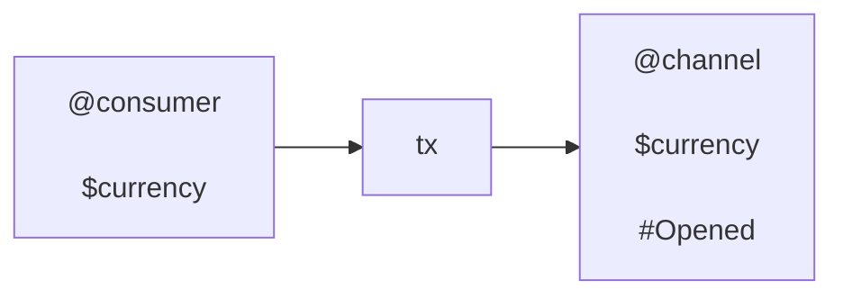

## Add tx

Consumer deposits more funds of currency `$currency` at their channel

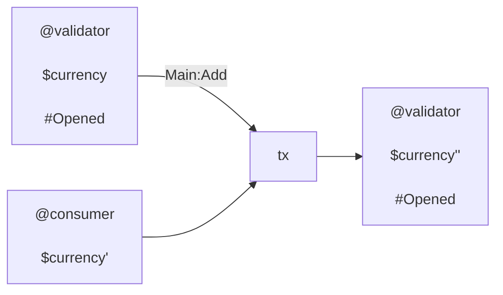

## Sub tx

Adaptor receives the amount the receipt indicates relative to the input state.
The output state is updated accordingly.

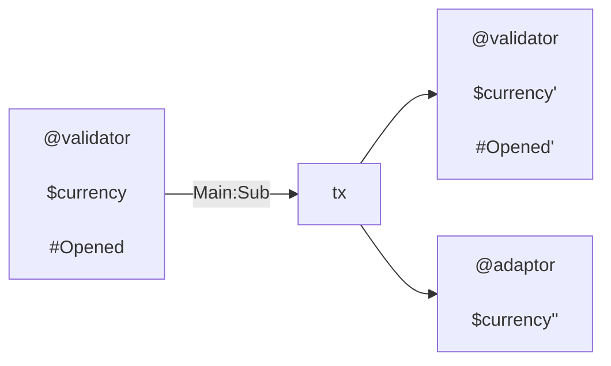

## Close tx

Consumer wishes to end their channel, and does a close

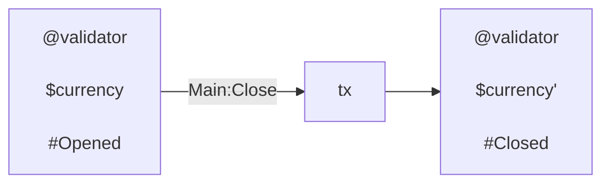

## Respond tx

Adaptor submits their final receipt. They claim funds owed, and leave locked
funds associated to pending cheques.

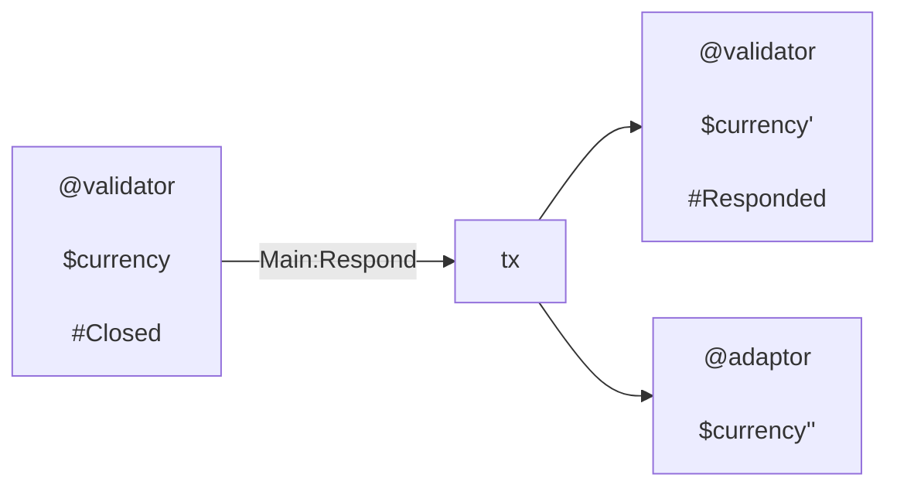

## Unlock tx

Adaptor reveals secrets associated to pending cheques. They take associated
funds.

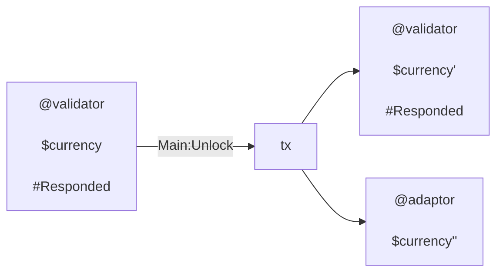

## Expire tx

Consumer submits tx pointing at the pending cheques that have expired. They take
funds demonstrably theirs.

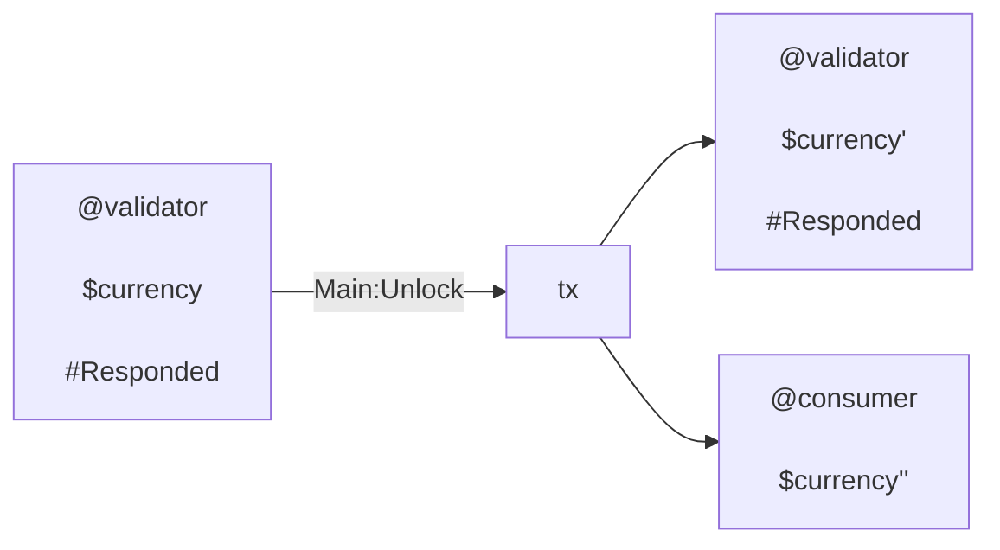

## End tx

Consumer ends a responded channel. All pending cheques are expired.

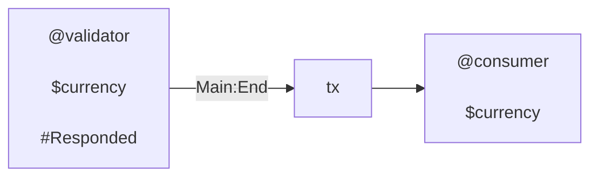

## Elapse tx

Consumer elapses a closed channel. Adaptor has submitted no final receipt in the
respond period.

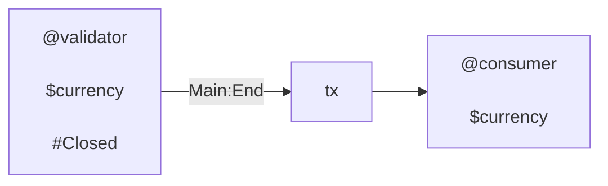

## Batch tx

A batch tx is "composition" of txs above.

FIXME: Remove multi-asset

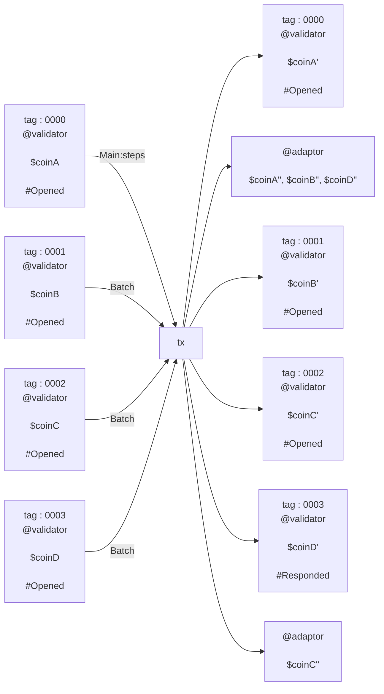

Note that steps ordering would be

```txt
  steps = [Sub, Sub, Sub, Unlock]
```

This might be a typical tx of a adaptor. Consumer can also submit batched
channel steps. There is no restriction on which steps appears.

## Mutual tx

If Consumer and Opertator agree, they can unstage a channel on their own terms:

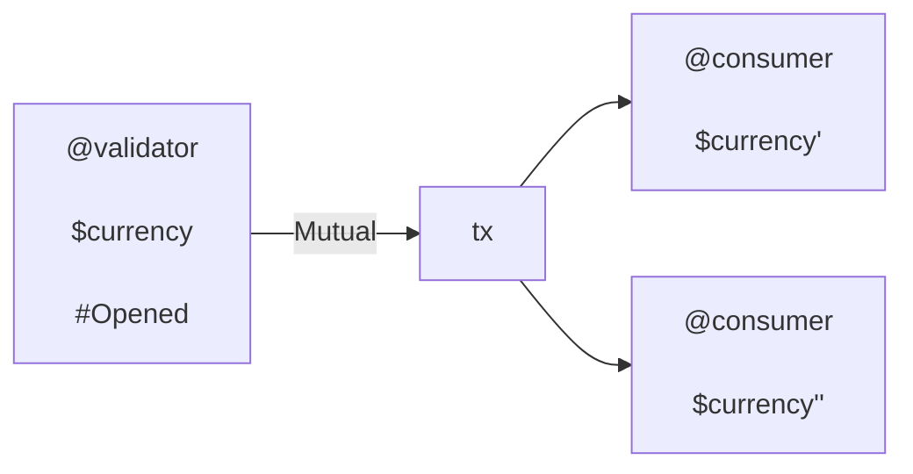

# Comments

## What if ...

> ... there are channels with the same tag?

See
[tag ADR](https://github.com/kompact-io/subbit-xyz/blob/main/docs/adrs/tag.md).

> ... a channel has the wrong `own_hash`?

Suppose we have a channel with incorrect `own_hash`. We say it is ill formed.
There are three cases to consider: one for each redeemer type.

If it is spent with `Mutual`, there is no problem, but also no issue. Both
partners consent. By the "solo" restriction, no other channel can be spent in
this tx.

If it is spent with `Main`, then it finds itself by `own_oref`. However, it then
fails since it's `own_hash` does not match that derived from its payment
credential.

If if is spent with `Batch`, then there must be another input from the indicated
validator address. If that validator cannot be executed (cos it is not known for
example) then the funds are stranded. If the validator can be executed then the
funds can be released.

Importantly note that an ill formed channel cannot be spent with `Main`, the
continuing output will have the correct `own_hash`. Thus, no continuing output
can be ill formed in this way.

It follows that such an input exists only when a consumer has spent their own
funds,  
and not those belonging to a partner. This property is in keeping with our
guiding principles of design: On-chain code keeps users safe from others, but
not necessarily from themselves. It is the role of off-chain code to keep
consumers safe from themselves.

> ... another channel has the wrong `own_hash`?

The above argument regarding an ill-formed channel allows us to restrict our
attention to the case of a tx in which:

- well formed channel is spent as either `Main` or `Batch`, and
- ill formed channel is spent with `Batch`

Regardless of the exact make-up as long as there is a `Main` spent, then the
well formed channels will be unaffected. It remains to justify that there is a
`Main` in the spend.

> ... there are `Batch` spends but no `Main`?

If there is a `Mutual` input, then solo validator input constraint will fail.

It remains to consider the case where there are only `Batch` inputs. One of
these must appear first in the inputs. On that invocation either:

- It is well formed. Thus it finds itself as first validator input, and fails
  since it matches on `own_oref`
- It is ill formed. Every well formed `Batch` input will find this as first
  validator input. They will then fail, since the `own_hash` value is incorrect.

In this case one of the `Batch` inputs will find itself b

> ... there is more than one `Main`?

This is possible, and it's not a problem.

We've already established that regardless of the other inputs, a `Main` must
appear as a first validator input. This invocation will conduct all the
verification over all subsequent channels. Any other invocations will simply be
re-doing some of this work. The purpose of `Batch` is to reduce the cost, by
avoiding this repetition.
